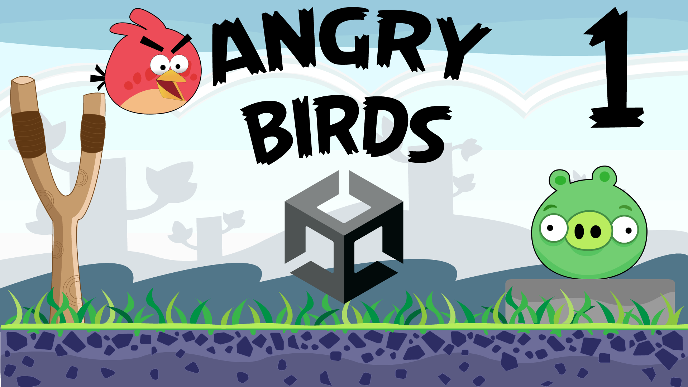

# Angry Birds (2D)

Lerne eines der am meisten heruntergeladenen Mobile Games aller Zeiten zu entwickeln. Angry Birds wurde von dem finnischen Entwicklerstudio Rovio Entertainment entwickelt und erstmals 2009 veröffentlicht. Angry Birds ist ein Level basiertes Game, in dem man Vögel aus einer Schleuder auf Schweine schießt.

- Schwierigkeitsgrad: Mittel
- Themen: Levelmenü, Werte abspeichern
- Version: 2020.3.26f1
- [🧰 Assets Download](https://github.com/PrezipGames/Angry-Birds/blob/main/AngryBirds.unitypackage)
- [🎮 Downloade das ganze Projekt](https://github.com/PrezipGames/Fruit-Ninja/archive/refs/heads/main.zip)
- [🎬 YT Tutorial](https://www.youtube.com/watch?v=t-1n-oEbgEY&t=48s)
- [💬 Joint unserem Discord Server](https://discord.gg/kusy4JQ4)
- [👍 Abonniert um keine Videos zu verpassen](https://www.youtube.com/@prezipgames)

## Viel Spaß beim Entwickeln!
 
